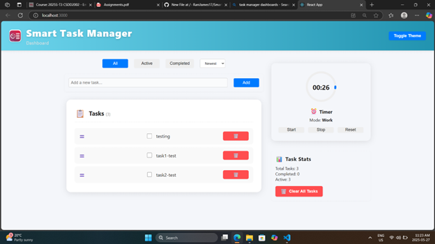

# Smart Task Manager

Smart Task Manager is a modern, responsive web app for managing your tasks and boosting productivity with a built-in Pomodoro timer.

## Features

- Add, complete, and delete tasks
- Sort and filter tasks (All, Active, Completed)
- Pomodoro timer with work/break cycles and animated progress
- Task statistics and quick clear actions
- Light/Dark theme toggle
- Responsive dashboard layout

## Dashboard Screenshot



## Getting Started

1. **Install dependencies:**
   ```sh
   npm install
   ```

2. **Run the app:**
   ```sh
   npm start
   ```

3. **Build for production:**
   ```sh
   npm run build
   ```